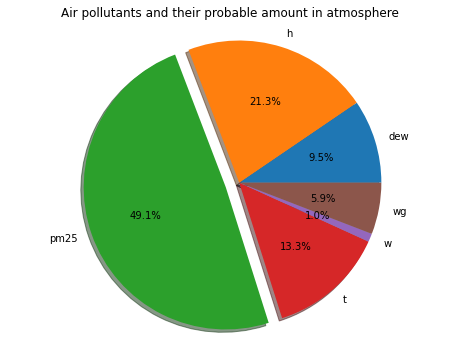
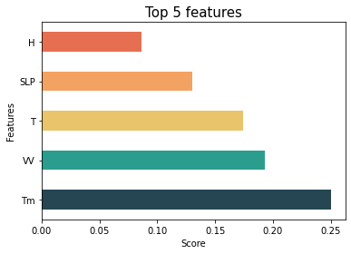

## Air Quality Prediction of Delhi


**Link : https://air-quality-predictor.herokuapp.com/**

## Table of Content
 * [Demo](#demo)
 * [Motivation](#motivation)
 * [Data Collection](#datacollection)
 * [EDA and Feature Engg](#complex)
 * [Model Building](#modelbuilding)
 * [Deployment](#deployment)
 * [Technologies Used](#technologies-used)
 * [To Do](#to-do)
 * [License](#license)

## Demo

## Motivation
Many website available on internet doesn't predict future air quality instead gives current date 
AQI the aim of the app is to predict AQI of locality based on certain factors. Air pollution can cause both short term and long term effects on health and many people are concerned about pollution in the air that they breathe.
## Data Collection
I couldn't find any relevant dataset for this purpose so I decided to scrape the climate data from **[this website](#https://waqi.info/)** using **Selenium and Beautiful Soup** which were really helpful. You can find the code for scraping **[here](#)** and to combine all data **[here](#)**.

## EDA and Feature Engg

* From the pie chart it is clear that all most 50% of air pollutant is from PM2.5(Particulate Matter) more info can be found out **[here](#https://en.wikipedia.org/wiki/Particulates)**. So the dependent feature was consider as PM2.5 . 
* Valuable insights such as **air quality deterioration during Winter seasons** and how much effective was **odd even formula** by Delhi Government can be found out with the help of charts in this **[folder](#https://github.com/nakul1010/Air-Quality-Index/tree/master/readme_resources)**.


* With the help of **correlation matrix & ExtraTreesRegressor algorithm** important and correlated features were able to identify.
* As in the pie chart SLP(Atmospheric pressure at sea level) is the most important feature for air quality index.

## Model Building

## Deployment
* The app was deployed in heroku which is **Platform as a Service(PaaS)**.
* Set the environment variable on Heroku as mentioned in _STEP 1_ in the __Run__ section. [[Reference](https://devcenter.heroku.com/articles/config-vars)]
 

* Our next step would be to follow the instruction given on [Heroku Documentation](https://devcenter.heroku.com/articles/getting-started-with-python) to deploy a web app.

## Directory Tree 
```
├── app 
│   ├── __init__.py
│   ├── main.py
│   ├── model
│   ├── static
│   └── templates
├── config
│   ├── __init__.py
├── processing
│   ├── __init__.py
├── requirements.txt
├── runtime.txt
├── LICENSE
├── Procfile
├── README.md
```

## Technologies Used
[](https://scikit-learn.org/stable/)  [](https://flask.palletsprojects.com/en/1.1.x/) [](https://gunicorn.org)  [](https://devcenter.heroku.com/categories/reference)
[](https://www.crummy.com/software/BeautifulSoup/bs4/doc/)

## To Do

## License
